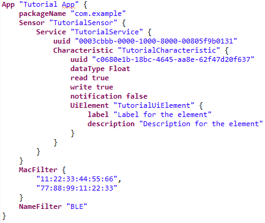
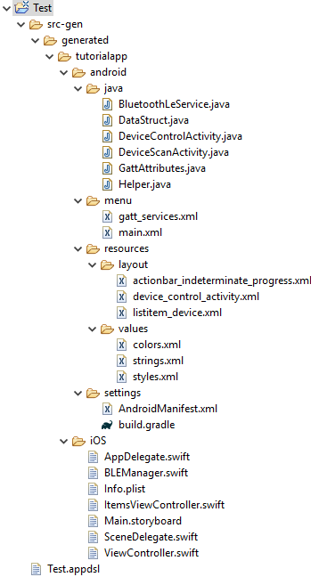
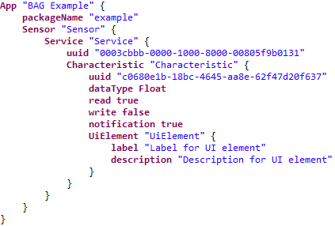

This project consisting of the <b>Ecore Diagramm Editor</b>, <b>EMF - Eclipse Modeling Framework</b> and <b>Xtext</b> represents a self made domain specific language with an integrated code generator for mobile applications which communicate with bluetooth low energy devices. With the defined domain specifig language inside this project you are able to describe the behaviour and functionality of a bluetooth low energy device. After describing the device the corresponding code for an Android and iOS application will be generated. The generated code implements the necessary bluetooth low energy functionality for the communication between the application and the device. There is also the possibility to define if an simple user interface should be generated or not.

## Table of Contents
- [IDE Setup](#ide-setup)
- [Import of the BAG library](#import-of-the-bag-library)
	- [Option 1: User](#option-1-user)
	- [Option 2: Developer](#option-2-developer)
- [Usage of the project and its domain specific language](#usage-of-the-project-and-its-domain-specific-language)
- [Possible adjustments in the generated code](#possible-adjustments-in-the-generated-code)
	- [iOS](#ios)
	- [Android](#android)
- [Example](#example)

## IDE Setup

1. Download the current version of the Eclipse Installer <a href="https://www.eclipse.org/downloads/">here</a>
2. Install the <b>Eclipse IDE for Java Developers</b>
3. After successfully installing the Eclipse IDE you can import the <b>BAG</b> library.

## Import of the BAG library

For using the library you have two options. Option one is for developer who want to edit or view the underlying code and the projects defining the domain specific language. Option two is for users who only want to use the defined domain specific language for generating the corresponding code.

### Option 1: User

1. Download <b>BAG_user.zip</b>
2. Inside the Eclipe IDE select <b>Help</b> -> <b>Install New Software...</b> -> <b>Add</b> -> <b>Archive</b> and choose the downloaded zip file
3. Install the plugin and restart the Eclipse IDE
4. Create a new general project via <b>File</b> -> <b>New</b> -> <b>Project</b>
5. Create a textfile inside the project with <b>.bag</b> as the extension
6. Accept the question if the project should be converted into an xtext project with <b>Yes</b>
7. Inside the <b>.bag</b> file you can describe your bluetooth low energy device and its corresponding features. By saving this file the code for an Android and iOS application will be generated in the appearing <b>src-gen</b> folder

### Option 2: Developer

1. After the installation of the Eclipse IDE you need to install the necessary additional libraries inside the Eclipse IDE:
	1. Select <b>Help</b> -> <b>Install New Software...</b> choose <b>All available sites</b> in the <b>Work with</b> field and search for the libraries.
	2. <b>Ecore Diagramm Editor (SDK)</b>
	3. <b>EMF - Eclipse Modeling Framework SDK</b>
	4. <b>Xtext Complete SDK</b>
2. Download <b>BAG_developer.zip</b> or clone the repository
3. Inside the Eclipse IDE select <b>File</b> -> <b>Import...</b> -> <b>General</b> -> <b>Achrive File</b> and choose the downloaded zip file
4. After successfully importing the project you can use the <b>BAG</b> library
5. If there are any errors displayed you need to edit some settings
	1. Open <b>Window</b> -> <b>Preferences</b> -> <b>Target Platform</b> -> <b>Running platform (active)</b> and choose <b>Edit</b>
	2. In the <b>Environment</b> tab edit the <b>Operating System</b> and <b>Windowing System</b> regarding your installed operating system
	3. E.g. for Windows you have to select <b>Win32</b> and <b>x86_64</b> as <b>Architecture</b>

## Usage of the project and its domain specific language

After successfully creating a project, like described above, you can use the domain specific language. The domain specific language consists of keywords and brackets like <b>{</b> and <b>}</b>. The editor in which you are using the domain specific language supports auto completion (by pressing Ctrl + Spacebar) and gives you feedback when something is missing or a wrong input has been done.

1. With the keyword <b>App</b> you create the main element of the application. This element needs a name defined like this <b>"\<name\>"</b>. For the <b>App</b> element and every other element you need to open <b>{</b> and close <b>}</b> these brackets.
2. Inside the <b>App</b> element you need to declare the package name of the application by using the <b>packageName</b> attribute and defining its value like this <b>"\<packageName\>"</b>.
3. Also inside the <b>App</b> element you need to create an <b>Sensor</b> element. The <b>Sensor</b> element needs a name defined like this <b>"\<name\>"</b> and you need to open and close the typical element brackets <b>{ }</b>.
4. Inside of the <b>Sensor</b> element you need to create at least one (you can create as much as you want) <b>Service</b> element. An <b>Service</b> element needs a name defined like this <b>"\<name\>"</b> and you need to open and close the typical element brackets. 
5. An <b>Service</b> element has an attribute called <b>uuid</b> which is defined like this <b>"\<uuid\>"</b>.
6. Also there needs to be at least one <b>Characteristic</b> element created inside the <b>Service</b> element.
7. An <b>Characteristic</b> element has an <b>uuid</b>-, <b>dataType</b>-, <b>read</b>-, <b>write</b>- and <b>notification</b>-attribute. There is also the possibility to add an <b>UiElement</b> element to define if an provisionally ui element should be created for it.
8. Finally you can add an <b>MacFilter</b>- and an <b>NameFilter</b>-element inside the <b>App</b> element to enable the corresponding feature.

Here is an example of such an instance:

	

In this example the application is called <b>Tutorial App</b> and the package name is defined as <b>com.example</b>. The <b>Sensor</b> element is named <b>TutorialSensor</b> and there is one <b>Service</b> element added with the name <b>Tutorial Service</b>. The <b>uuid</b> of the <b>Service</b> is <b>0003cbbb-0000-1000-8000-00805f9b0131</b>. The <b>Service</b> element has only one <b>Characteristic</b> element named <b>TutorialCharacteristic</b>. The <b>uuid</b> of the <b>Characteristic</b> is <b>c0680e1b-18bc-4645-aa8e-62f47d20f637</b>, the <b>dataType</b> is set to <b>Float</b>, the <b>read</b> and <b>write</b> options are set to <b>true</b> and the <b>notification</b> option is set to <b>false</b>. There is also one <b>UiElement</b> added to the <b>Characteristic</b> element leading to the creation of ui elements for that <b>Characteristic</b>. In the last few lines there is a <b>MacFilter</b> with the two example MAC-addresses <b>11:22:33:44:55:66</b> and <b>77:88:99:11:22:33</b> defined and a <b>NameFilter</b> with the expression <b>BLE</b>. In this example the application would only list bluetooth low energy devices matching the defined MAC-addresses and the defined <b>NameFilter</b>.

After saving the domain specific language file (.bag) the following structure should be generated:

	

You can see there is a folder created with the name of the application. There is one folder for the Android and one for the iOS related code. The folder structure giving you a hint where you need to import the files inside the corresponding IDE (Android Studio and Xcode).

## Possible adjustments in the generated code

### iOS

<b>BLEManager.swift</b>

Inside the <b>didUpdateValueFor</b>-method there is a TODO-statement for every defined characteristic. At this point you can add your own code to handle the received data and do a conversion of the incoming data if needed. In the generated code version the first byte of the incoming data is used.

<b>ViewController.swift</b>

If you have defined characteristics with the write-option set to true and also decided to create an ui-element, than you can add your own code inside the <b>writeTextField...</b>-methods. There is a TODO-statement where you can add code to receive the input from the corresponding TextField and convert it if necessary.

### Android

<b>DataStruct.java</b>

Inside every <b>set</b>-method there is a TODO-statement. At this point you can add your own code to handle the received data and do a conversion of the incoming data if needed. In the generated code version the first byte of the incoming data is used.

<b>Helper.java</b>

In every <b>writeCharacteristic</b>-method there is a TODO-statement. At this point you can add your own conversion method or adjust the already existing ones.

## Example

For an example application we are using the [CY8CKIT-042-BLE-A Bluetooth Low Energy 4.2 Compliant Pioneer Kit](https://www.cypress.com/documentation/development-kitsboards/cy8ckit-042-ble-bluetooth-low-energy-42-compliant-pioneer-kit) by Cypress. There are several example configurations available for this kit. With these configurations the kit behaves like a real working BLE device with it's defined functionality. 

In this example we are using a configuration which has only one defined service and characteristic. The characteristic will send values of one sine wave as float 32 values (HEX coded) via notification. For using the BAG library and it's DSL we need information of the defined characteristic like the uuid and the data type of the incoming data. So we got the following configuration given for our example:

- <b>Service UUID:</b> 0003cbbb-0000-1000-8000-00805f9b0131
- <b>Characteristic UUID:</b> c0680e1b-18bc-4645-aa8e-62f47d20f637
- <b>Data Type:</b> Float 32
- <b>Interaction via:</b> Notification

We are starting by using the BAG DSL to define the given information:

	

These are all the information needed for the initial generation of the application code. We also decide to generate an ui element for the defined characteristic.
